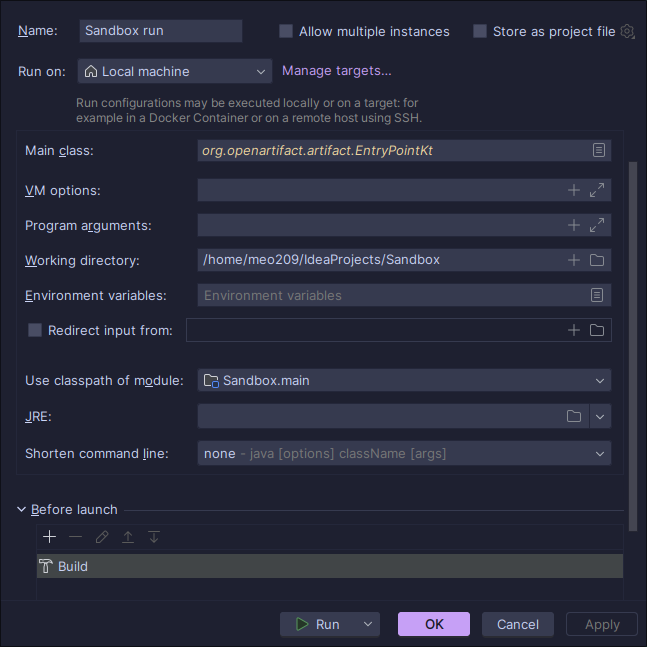

# Sandbox

An example project for the [Artifact Game Engine](https://www.github.com/Artifact-Engine/Artifact).

Name "Sandbox" inspired by TheCherno.

### Note
The setup process is not finalized and will change in the future.

## Setup
### Requirements:
Java (JVM & JDK (Version 17+)) <br>
Kotlin <br>
IntelliJ (Or any other IDE that supports kotlin & java) <br>
Artifact Engine

The folder structure should look like this:

```
<root folder> (e.g. IdeaProjects)
 - Artifact
  - src
  - gradle
 - Sandbox
  - src
  - gradle
```

The first thing you should do is rename your project. This is done by going to [settings.gradle.kts](settings.gradle.kts) and then setting ``rootProject.name`` to your project name.
You may also need to rename the IntelliJ module. To do this go to
File -> Project Structure -> Project. There will be a text box called "Name".

On startup Artifact will search for all classes that have the annotation 
```kotlin
@ApplicationEntry
```
present.

If a class is found, it is loaded and an application is created.
The application is then passed to the engine for further processing.

Here is an example Application (name e.g. Game:
```kotlin
@Entry
class Game : Application(RenderAPI.OpenGL) {
    
    override fun init() {
        logger.info("Game init")
    }

    override fun update() {
        logger.info("Game update")
    }

    override fun shutdown() {
        logger.info("Game Shutdown")
    }
}
```

Make **sure** to inherit the ```Application``` class in your Game.
Also, the constructor for the ```Application``` class defines the renderer api to use.

### Start

Running the project requires creating a run configuration like this:



Make **sure** that "Use classpath of module" is set to ```<Project Name>.main``` and the Configuration is of type 'Kotlin' **not** 'Application'.

To get debug logs, add the following line to your VM options:
```
-Dorg.slf4j.simpleLogger.defaultLogLevel=debug 
```

## Export
To export your project, you just need to execute the ```export``` gradle task:
```
./gradlew export
```

## Note
You may want to use [ArtifactDebug](https://www.github.com/Artifact-Engine/ArtifactDebug) for easier development.

### Using ArtifactDebug
To use ArtifactDebug you need to download it and place the downloaded directory in the same parent directory as your project (e.g. IdeaProjects).

Then add this line to your [settings.gradle.kts]():
```kotlin
includeFlat("ArtifactDebug")
```
Then, add the following to your [build.gradle.kts]():
```kotlin
implementation(project(":ArtifactDebug"))
```

# License
[GPLv3](https://www.gnu.org/licenses/gpl-3.0.html)
